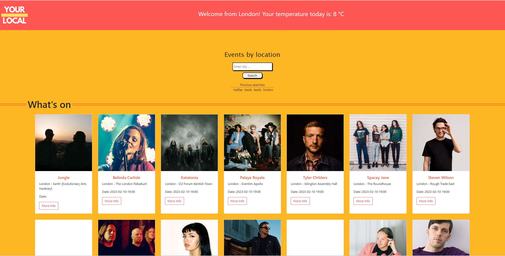
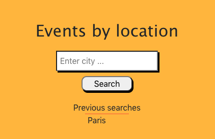
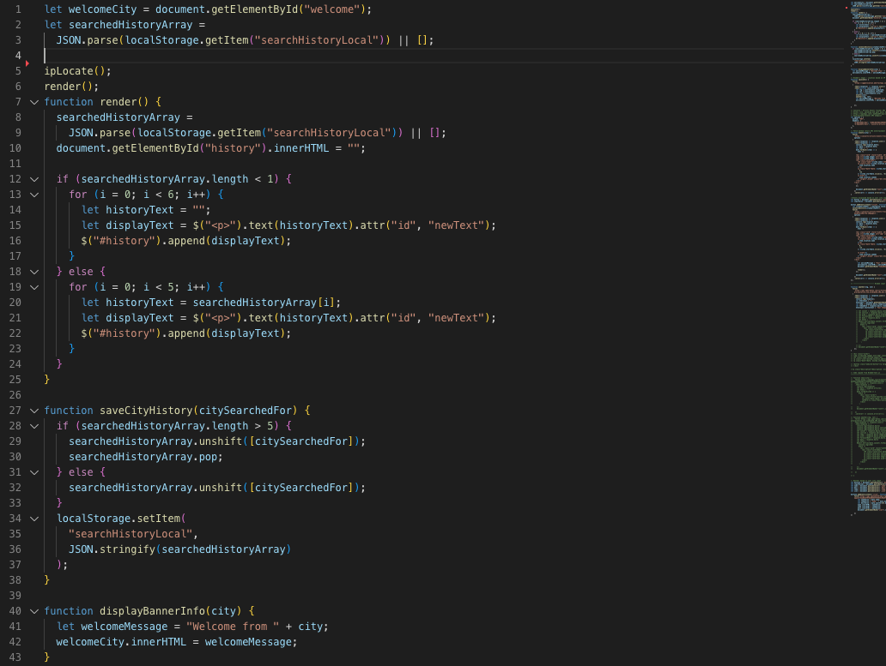
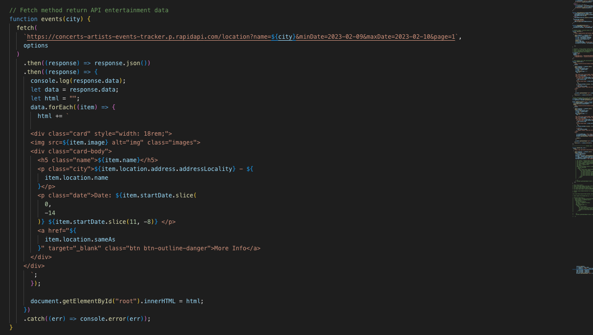
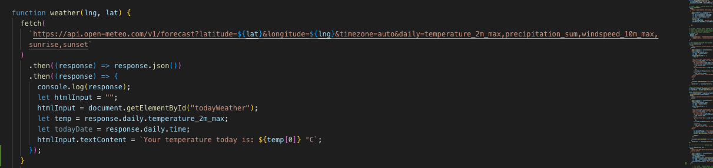

# Your Local!

## User story:

As a news-hungry individual who is always on the go, I want to have access to a website with an API that provides me with the latest local news, entertainment, and weather updates based on my current location. This way, I can stay informed about what's happening around me and plan my day accordingly, without having to search for information from multiple sources. The website should be user-friendly, and the API should be easy to use and integrate into my other applications.

## Table of content
1. [User story](#user-story)
2. [Description](#description)
3. [API](#apis)
4. [Website Layout](#website-layout)
5. [Code sample](#code-sample)
6. [API code](#api-code)
7. [Usage](#usage)
8. [Project Contributors](#project-contributors)
9. [Future contribution](#future-contribution)
10. [Deployed Links](#deployed-links)
11. [License](#license)

## Description

This page incorporates the use of different API's on a complete site which allows a user to enter their details and their location is pin pointed and the news for their area is displayed. Allowing for a more user tailored experience, a colour pallet was chosen as wel as fonts that are more inviting and "fun" allowing for better mental engagement and memory.

## API's
IP location API:
https://ipgeolocation.abstractapi.com/

Entertainment API:
https://rapidapi.com/

Local weather API based on IP location:
https://api.open-meteo.com/

User city input weather API
https://api.openweathermap.org

News API
https://gnews.io

## Website layout

* Welcome section:

  

* Website Navbar:

  

* Events based on user city input:

  

* Search history:

  

* Section title:

  

* Events based on user city input:

  

* Footer with contact section:
  
  

## Code sample

  * Code save user city input:

   
  
## API code
  
* Events:
  
 
* Weather based on IP location:
     
 
 
## Usage

* As aforementioned, this page uses many APIs across the whole site, enabling users to submit their information, have their location pinpointed, and get the local news. 
* A colour scheme and typefaces that are more appealing and "fun" were chosen to enable for a more user-tailored experience, improving mental engagement and recall. 
* Users will get access to the website, which gives them the most recent information on local news, entertainment, and weather based on where they are. Keeping up with local events so they may organise their day properly without having to look up information from many sources.

 
 

## Project contributors: 
 Team working on this app:
 
   [Gioevani](https://github.com/Gioedx) 
     
  [Wlodek](https://github.com/WloMac)
     
  [Mariusz](https://github.com/gines18/)
     
  [Shahid](https://github.com/QByter)
     
     Teaching Assistant: Martin William
     
## Future contribution:
     
     If you would like to contribute to the development of this project, please reach us by GitHub

## Deployed Links

  * GitHub repository: https://github.com/WloMac/YourLocal

  * Deployed website: https://wlomac.github.io/YourLocal/
## License

Please refer to the LICENSE in the repo.
