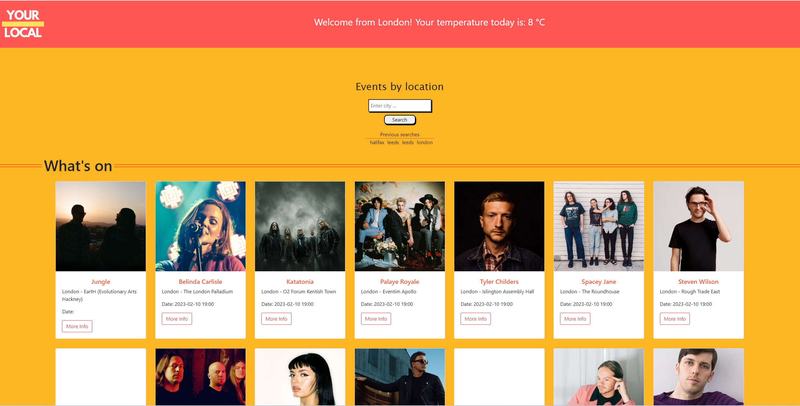

# Your Local!

## Description ##

An interactive app for obtaining local information based on the automatically detected user's IP geolocation. Your Local! Will display entertainment news, local weather, and the day’s news items.

The user has the option to switch cities and get local information for the chosen location.

 
 
 

 
 
 

## Usage

The app is simple to use. Initially there is no interaction required, as information relating to the user's locations will be displayed automatically. Thereafter, explore the cities of the world - and maybe pick an event to visit.

 
 

## Our story

As a news-hungry individuals who are always on the go, we wanted to have access to a website that provided me with the latest local news, entertainment, and weather updates based on my current location. Now we stay informed about what's happening around us as we travel, without worrying about where we are. 

We wanted to make the website user-friendly, east to navigate and use.

 
 
## Technologies Used:

- HTML
- JavaScript
- APIs:
- IP location API: https://ipgeolocation.abstractapi.com/
- Entertainment API: https://rapidapi.com/
- Local weather API: https://api.open-meteo.com/
- CSS

## Links

- GitHub repository: https://github.com/WloMac/Sam-Wlodek-Mariusz-Gio-Project-WorkingName
- The deployed link:  

 
 
 
 
### Your Local! 2023
